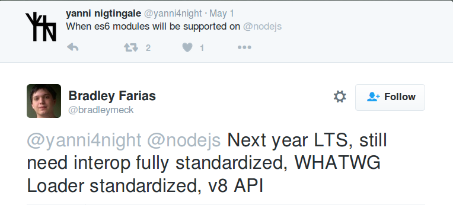
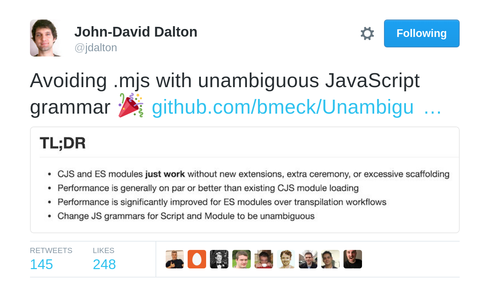

title: node.mjs

output: index.html
style: style.css

--

# myNodeModule.mjs?
By Hugo Agbonon ([@codeheroics](http://twitter.com/codeheroics))

--

## We're talking about...

* node.js and its future
* ECMAScript 2015

--

## node v6
* Supports 93% of ECMAScript 2015


--

## node v6
* Does not support ES Modules


--

## Modules

**CommonJS**: What node.js has been using
```js
const fs = require('fs')
const { networkInterfaces } = require('os')
const msg = 'Hello'
module.exports = { msg }
```
**ES Modules**: The standard from now on
```js
import fs from 'fs'
import os, { networkInterfaces } from 'os'
export const msg = 'Hello'
```

Seems simple to move from one to the other, right?

--

## Differences

* ES modules cannot be conditionally required
* ES modules need to be (import/export)ed from the top level of the module
* ES modules are [static](http://www.2ality.com/2014/09/es6-modules-final.html), export [immutable bindings](http://www.2ality.com/2015/07/es6-module-exports.html)
* **ES modules are always in strict mode and are parsed differently**

--

## Strict mode, parsing differences mean...

**The same code won't work the same way whether it's in an ES Module or a CommonJS Module**
* (As an app developer, you probably won't have to worry too much about that though, the parsing differences are subtle)
* However...

--

## Since they work differently

* Node needs to find out, **without error**, if a module is a CommonJS or ES Module.

--

## How can it be done?

* It's not as simple as it seems
* Checking for `import` and `export` is not enough: You can have ES modules without those keywords

```js
console.log(`Module loaded ${Date()}`)
```
is a valid ES Module

--

## 4 Options to handle this in node.

1. `'use module'`
1. myModuleName.mjs
1. Automatic Detection
1. Information in package.json

--

## 4 constraints

* **Maximum interoperability**: Existing requires must continue to work with no changes
* **Poly-Packages**: Library authors shoud be able to create packages that work with new and old versions of Node
* **Agnostic Usage**: Apps don't need to know if the module they're using is an ES or a CommonJS Module
* **A Future Without Vestiges**: The standard should be favored in the future.

--

## Rejected solutions

1. ~~`'use module'`~~ - Boilerplate code which can never go away
1. ~~Automatic Detection~~ - Impossible
1. ~~Information in package.json~~ - Tedious to do and maintain. Disables some workflows. Requires a package.json.

--

## Chosen Option

1. ~~`'use module'`~~
1. myModuleName.mjs
1. ~~Automatic Detection~~
1. ~~Information in package.json~~

[The current official node proposal is for .mjs](https://github.com/nodejs/node-eps/blob/master/002-es6-modules.md)


--

## mjs is simple

* .mjs tells explicitly that a is an es module
* .mjs files will have the priority when `require`d or `import`ed
* .mjs files require no configurations or declarations
* .mjs files will "just" replace your .js files, and (mostly) everything will be the same

--

## mjs is simple

* .mjs files only hurt feelings (because we <3 our .js)


--

## Is this happening? When?



* The proposal is still a draft, which means its [implementation hasn't started](https://github.com/nodejs/node-eps/blob/master/002-es6-modules.md)
* Maybe around node v10?

--

## Get ready for (node).mjs...


--

## Or... maybe not.

What if automatic detection was possible after all?


--

## Hot from last week



--

## Proposed solution: Change JS syntax to avoid ambiguities

A module **requires** an `import` or an `export`

All modules are parsed. If it doesn't contain any of these statements, it is not an ES Module.

--

## So for the previous example

```js
console.log(`Module loaded ${Date()}`)
```
Would be recognized as a CommonJS module, while

```js
console.log(`Module loaded ${Date()}`)
export {}
```
would be an ES module.

.js files, without ambiguities, without package.json setup (except a single field for libraries)

--

## Will this pass?

# ¯\\\_(ツ)\_/¯

* The main issue: Changing JS spec for a **node.js** issue.
* JS in browsers don't need this as `<script type="module">` resolves problems.
* Node could also impose mandatory `export` and `import` statements in modules...
* But it would officially be only implementing a subset of ECMAScript.

--

### Thank you!

<div class="author" style="margin-top: 30px;">
  
  <h3>
    Me: <a href="http://twitter.com/codeheroics">@codeheroics</a>
  </h3>
  <h3>
    This: <a href="http://bit.ly/parismjs">bit.ly/parismjs</a> (resource links at the last slide)
  </h3>
  <h3>
    (& Follow [@bradleymeck](https://twitter.com/bradleymeck), [@jdalton](https://twitter.com/jdalton) &   [@nodemjs](https://twitter.com/nodemjs) for more infos on this!)
  </h3>
</div>

--

### Cool links

* [Node.js Enhancement Proposal](https://github.com/nodejs/node-eps/blob/master/002-es6-modules.md)
* [Understanding the hard choice](https://medium.com/@bradleymeck/understanding-the-hard-choice-1ea3008fc9d0#.nsyo388o4)
* [In Defense of .js](https://github.com/dherman/defense-of-dot-js/blob/master/proposal.md)
* [ES6 Module Detection in Node](https://github.com/nodejs/node/wiki/ES6-Module-Detection-in-Node)
* [@bradleymeck](https://twitter.com/bradleymeck)
* [@nodemjs](https://twitter.com/nodemjs)
