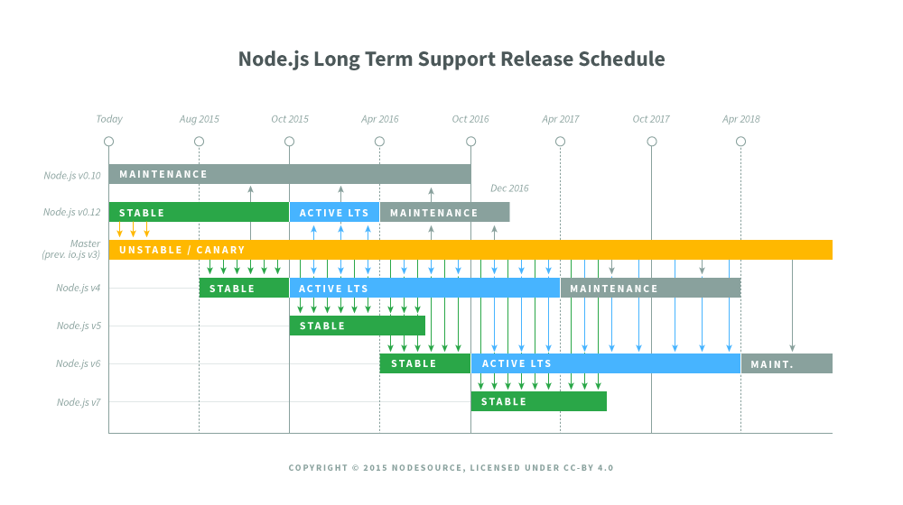

title: Finally, node v4
output: nodev4.html
style: style.css

--

# Finally, node v4!
## Celebrating the end of the 0.x series

--

### A ~~brief~~ timeline

* 1995 : JavaScript
* 2008 : V8
* 2009 : Node.js

--

### A ~~brief~~ timeline

* March 2013 : **Node.js 0.10**
* December 2014 : **io.js**

--

### 2015: io.js VS node.js


* January 2015 : **io.js 1.0**
* February 2015 : **Node 0.12**
* February 2015 : **Node.js foundation**
* July 2015 : **Merge announcement**

--

### And finally
* September 2015 : **Node.js 4.0.0**
* Today : **Node.js 4.1.1**
* Next month and beyond: **Node.js 4.x.x, Node.js 5.x.x**


--

### Why "node v4"?

* io.js was at 3.0
* New semantic versioning

--

### What's new? (since node 0.12)

* **Massive** V8 upgrade (3.28 --> 4.5)

which results in...

--

### What's new? (since node 0.12)

* Performance upgrades

* Lots of <a href="http://hugo-agbonon.github.io/presentations/es2015">ECMAScript 2015</a> features! \o/
  * Arrow functions
  * Generators
  * let, const
  * Destructuring
  * Methods
  * Classes
  * etc

--

### Should I upgrade?


... But check your native dependencies before doing it.


--

### The future



Frequent releases, Long Term Support.

--

### Thank you!

```
nvm install v4;
nvm alias default v4;
node --version;
```
<div class="author" style="margin-top: 30px;">
  
  <h3>
    Me: <a href="http://twitter.com/hugo_agbonon">@hugo_agbonon</a>
  </h3>
  <h3>
    This: <a href="http://bit.ly/node-parisjs">bit.ly/node-parisjs</a>
  </h3>
</div>
