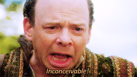
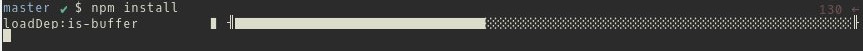

title: npm 3
output: index.html
style: style.css

--

# npm 3
## new parisjs meetup
#### no pikachus mutilated

--

### Timeline
#### naming patterns matters

* 2009 : Node.js
* 2010 : npm

--

#### nonviolent pigeon manifestation

Can you imagine Node without npm?

--

### Timeline
#### nepotic pasta muncher

* 2009 : Node.js
* 2010-01 : npm 0.0.1
* 2011 : npm 1
* 2014 : npm 2

--

### npm 2
#### nobody pays michael

<blockquote>"In npm@2.0.0, Ben changed npm run-script to allow you to pass arguments into scripts. That’s a breaking change. It’s as simple as that."</blockquote>

--

### npm 2
#### now playing mario

(but that's good, and what semver is for)

--

### Yet, npm is far from perfect
#### naruto punches macgyver

* <code>npm shrinkwrap</code> is unreliable
* Dependencies tree is bad for front-end use
* Dependencies tree is bad for sanity (also, Windows)
* Sometimes fails for no reason

--

### npm 3
#### never program mummies

Why would it be more important than npm 2?

<blockquote>"npm@3 constitutes a nearly complete rewrite of npm's installer to be easier to maintain, and to bring a bunch of valuable new features and design improvements to you all."</blockquote>
--
### npm 3
#### noop(); pop(); map();
* 2015-06-25: [v3.0.0](v3.0.0) with **THIS IS BETA SOFTWARE** written in bold italic capital letters
* 2015-09-17: [v3.3.4](https://github.com/npm/npm/releases/tag/v3.3.4), out of beta

--

### npm 3
#### nerdy programmers mingling

* New install process (getting rid of race conditions)
* Fancy new install bar

* Dedupes dependencies by default
* npm uninstall cleans module and its dependencies
* Less problems with peerDependencies
* Fixes all shrinkwrap issues... [Soon. Probably. Hopefully.](https://github.com/npm/npm/issues/9703)

--

### Should I upgrade?
#### no problem man

I'd love to say "hell yeah"

But wait just a bit if you depend on shrinkwraps (and if you don't, you should consider it).

--

### The future
#### newbie pwns master

There's a [roadmap](https://github.com/npm/npm/wiki/Roadmap) on npm's Github with short-term and long-term goals/ideas.

--

### Install it
#### nanotechnology promises much
<code>npm install -g npm # yes, really.</code>

If you don't, use [nvm](https://github.com/creationix/nvm)
--

### Thank you ParisJS! 50 meetups ! \o/
#### now pizzas munching?

  
  <h3>
    Me: <a href="http://twitter.com/codeheroics">@codeheroics</a>
  </h3>
  <h3>
    This: <a href="http://bit.ly/npm3-parisjs">bit.ly/npm3-parisjs</a>
  </h3>
  <h3>Finding new meanings to npm's acronym: [github.com/npm/npm-expansions](https://github.com/npm/npm-expansions)</h3>
  <h3>More info on [Github](https://github.com/npm/npm/releases) & the [npm blog](https://github.com/npm/npm).</h3>

